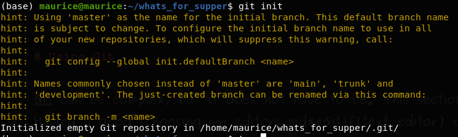
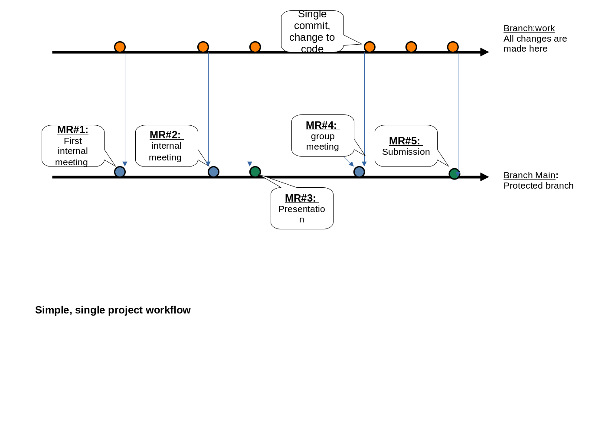
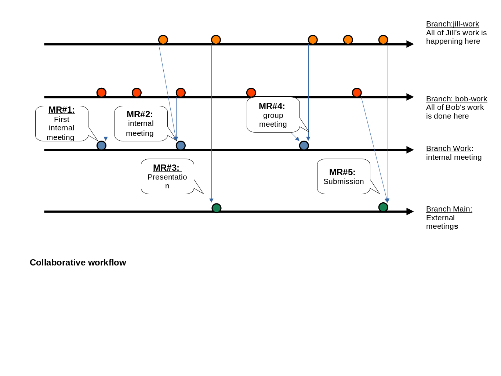

# Why git? 
- *SOLVES FOR* -> what did I do? Need to go back to last version? 
- *REQUIRES A* -> different way to work 

*Key ideas*

- Research is incremental

- Coding is incremental 

- Version controls (git) allows you to focus on incremental changes 

- allows for better orchestration around code 

# Why Git? 

Git is a distributed version control system, it is flexible and widely used. Created by the Linux Kernal developer. Learning git is a transferable skill that builds efficiencies whenever you work with code. 

Starting to use git requires a slightly different way of working, that may feel like it is adding an administrative burden to you project (why am I commiting this?). The workflow encourages better coding practices as it often forces you to stop and think about the changes you just made and why you made them. 

Every time you record a change to the repository, known as a 'commit', git take all of the files in your repository and uses them to create a Hash to sign the changes. Having these hashes and knowing what version of paper or presentation came from a hash allows us to link code to the research. 

## Whats the difference between git and GitHub 

`git` is version control software that underpins all of the actions on your machines  or on servers you connect to. There are providers that make front ends that make it easier to follow changes made to the code,e.g. GitHub/Gitlab. 
These services often run on the cloud and ingest `git` changes and present them in easier to view webpages. 

In addition GitHub has other features such as issues, pull requests and in line commenting around code that makes collaborating or tracking incremental changes to code much eaiser. GitHub/GitLab 
is also a standard in software development and being at least exposed to it will allow you to interactive with the open data science community and be better positioned to understanding different software packages available. 
 
# Using Git 

Git can be complex, but it does not have to be. This section introduces the basics to using git. 
Having a good [choosing_text_editors.md##Git]([text editor) can make using git painless. 

Once you have git installed you will need to make sure its configured with a username and password, these are used to sign
changes to the code base. 

```Bash
git config --global-user-name "my name"
git config --global-user-email "my_email@yale.edu"
```


## Initializing a Git repository 

As long as git is installed users initialize a repository by going to the folder and using the command `git init`. 
For example here is what it looks like when you initialize a repo in the `whats_for_supper` project. 


The entire repository lives inside of a `.git` files and that is all that is created for you. For the most part you do not need to make 
changes within this file. 

It is best practice to create a `.gitignore` file in the root directory of the project. This is simply a text file that tells git what to ignore. 
For example, you may which to ask git to ignore changes made to log files or data files as is often best practice. 

``` .gitignore 
*.log
*.dta
*.csv
*.lst 
```

## Adding changes to the repository 

Once a repository is initialized, the next step involves adding code to git. To understand this process all you need to know that git 
will search your repository for changes made. When a change is made it shows up as `unstaged`. 

If you just started a new repository, git does not know what folders it should be looking at. To begin with you need to start out by 
adding folders to the repository via `git add /folder/to/add`. Further, you should be sure that the `.gitignore` file is up to date since this will 
save you the headache of unstaging files you do not want in your repository.

Generally, adding changes to your repository comes in to steps, there is a temporary step called `staging` where you move changes to, this maybe a useful way to group many changes into a series of single commits.

Once you `stage` changes then you can push them to the repository with a `commit`. This takes a message and records all of the changes as well as hash based on the changes made so you can always go back to that process. 

Git paradigm involves working in a repository 

1. staging area (pre commit, can unstage)
         
2. commit areas (immutable)

## Strategies for grouping commits into meaningful chunks of work 

1. commits

2. branches 

3. Pull/Merge requests 

### What are forks? 
A fork is a copy of a repository, often place in your name space rather then the DISSC space for example. 
Its useful in that it creates a complete sandbox of the repo for you to make and change you want with out worrying about how it might impact other users. 

### What are branches? 

Branches are copies of a codebase that is within the same repository but sitting in a separate branch then the main branch. 
For example, there maybe a main branch in a repository and a separate branch for my work might be called `maurice` or specific update like 
`prep_for_nber_si_presentation` may work but is within a single repository. These branches can more easily be observed since they all sit within the same repository. Note that forked repository can also be compared but we need to make sure we add the forked repository remote path to the repository. 

### What is a Merge request ? 

Git is decentralized in the sense that many different repositories may exist. In such a world how are changes shared? The idea of merge request involves merging code changes in a branch or fork of repository into another repository. This is often done in the sense when there is one main repository where everyone is pushing changes toward. 

What if we are not collaborating across users or repositories?: Then Merge requests are still a useful tool in that it allows us to group changes to the code in a meaningful manner. Through the use of a webfront end like gitHub it also allows to easily look at all the changes made, add some text to give a high level over view of the spirit of the changes and call out individuals to review the code. 

MR do not go away so they create institutional knowledge which connect key changes made to the code base and how they impact a research project. 

So if multiple people are making changes to a single source of truth repository then how can we be sure that our local repositories are kept upto date? 
This is where 

#### Anatomy of a good merge request 

### What is Fetch? 

Remember git is decentralized, if you want to look at changes made in other branch or other forked repository you must first do a `git fetch` all of the other
repositories you are "watching". In terms of git, "watching" means that you have created a `git remote` this tells git `


# Git and GitHub

GitHub can be though of as a remote front end for using git. It makes collaboration and code review easier and has some nice built in project management features buiilt into it. 

## Connecting to GitHUB 

1. We use ssh keys , put the public key into GitHub 
https://www.atlassian.com/git/tutorials/git-ssh
         
## Working with decentralized version control systems 

1. local version of a git repository has all of the history from where you cloned repository 
2. git connects to other repositorys by adding a `remote` repository. This repo can live locally in another folder or can live in the cloud. 


# Workflows

To fork or to branch? These are really different paradigm to working on a project. For the purpose of this group we will be working of separate branches on the same hosted github repository. That way its easier to compare what people are working on. If you find that you are working off many different branches then its ok to fork. 

Protecting a branch is a way of making sure that a branch remains a source of true, where code should be reviewed before being pushed and if possible should be working before being pushed. When a branch is protected, a typical way of pushing code is through creating merge requests (MRs)

   !!! Do these work on dropbox? No if more then one person is making change. 
      Unless you unsync the program folders. !!!

## Single researcher



## Collabrative workflows 




## Incrementing changes - working of diffs 

Git provides a ways to roll back changes which is useful. The real power in git comes from being able to 
track changes you have made since last comit or stage. Being able to work of differences or changes allows you to concentrate on what you have been changing. Its useful when projects get put down or if you have been strategic betwen 


## Collaborating 

- chat feature around pull requests
- raising issues ; not always necessary. 

# Best practices 

 - Too commit large or small changes ?
  - Creating a branch?
  - Do i need pull request 


## Starting a new project 

When starting a new project, create the project on GitHub making sure to use one of the templates. 


If you want to bring a current project into gitHub, you can create a repo on GitHub and add the `remote` to the repository 
via 

`git add remote upsteam git@github.com:Yale-Health-Econ/doc_health.git`

## Creating a new merge request 


 - test repository people can do whatever they want to without worrying with breaking anything 

 main 

# Working through some examples 

Ready to try out some example. [See the git onboarding section for setting up ssh key and some examples to try out](../onboarding/connecting_to_github.html)


# Other resources 

- https://skills.github.com/ ; go through and borrow and tune to the way we will work
- https://raw.githack.com/uo-ec607/lectures/master/02-git/02-Git.html#1 : Great intro slides  
- dropbox and git -- https://github.com/kbjarkefur/GitHubDropBox
- https://github.com/worldbank/dime-github-trainings 
