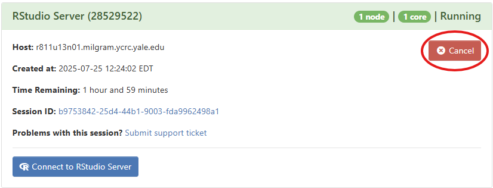

# Interactive Sessions

Open OnDemand (OOD) is a web-based portal to access YCRC cluster's resources. Using Open OnDemand (OOD), you can start interactive sessions on a high-performance computing (HPC) cluster through a browser.

See the [Yale Center for Research Computing (YCRC) page](https://docs.ycrc.yale.edu/clusters-at-yale/access/ood) to access this at Yale.

As part of starting an interactive session, you may need to set a few parameters, which will determine what hardware and software is available in the session, as well as the session length.

If you're starting an interactive app (such as RStudio), the first thing you may need to select is the software version.
It is generally best to select the latest version.

## Hardware

Parameters that relate to the hardware: 

- **Number of Hours**: How long you need the session to run. Start with a short duration for testing. It is good practice to stop your session when you are finished by clicking on `Cancel` in My Interactive Sessions.

<div style="text-align: center;">
  
</div>

- **CPU cores**: This will determine how many cores / threads you will be able to use, and, if memory is tied to cores, how much total memory you have available. For simple tasks, 1 or 2 CPUs is sufficient.
- **Memory**: This will determine the amount of memory / RAM you will be able to use, which will be particularly relevant if you want to load in large portions of data into memory.
- **Partition**: These may have different hardware (such as CPU types, or GPUs) and different limitations (such as number of CPU cores and amount of memory). The `devel` partition is the default but limits you to 32 GiB of memory. The `day` partition provides access to higher-memory machines.

The appropriate settings will depend on what you're doing, but if you run into issues (such as if things are running slowly or crashing), you might try adjusting these parameters.

## Software

Additional software can by loaded through modules. From a terminal (e.g., accessible from Clusters > Shell Access on an OOD dashboard), you can use the `module spider` command to find specific module names.

For instance, you might need [Arrow](https://arrow.apache.org/docs/index.html), so you could search through available modules:

```sh
 module -r spider 'Arrow.*'
```

For more information about modules, please review [YCRC documentation](https://docs.ycrc.yale.edu/applications/modules/).

Contact DISSC at `dissc@yale.edu` or YCRC at `hpc@yale.edu` if you have any questions.