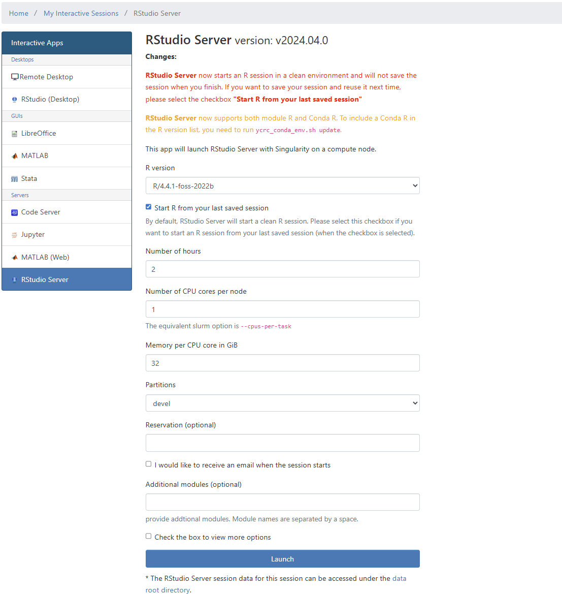

# YCRC cluster quick start 

This document outlines the process for setting up an account, accessing data, transferring files, and working on the Yale high-performance computing (HPC) clusters.

Please review the Yale Center for Research Computing (YCRC) [policies and best practices](https://docs.ycrc.yale.edu/clusters-at-yale/access/accounts/).

-

## Requesting a YCRC Account

If you do not already have a Yale Center for Research Computing (YCRC) HPC account, you can request one for the desired cluster by filling out the [account request form](https://research.computing.yale.edu/support/hpc/account-request). For example, you should specify the `Milgram` cluster if the data you data you want to access lives in Milgram. Once you complete the form, YCRC will reach out to you. Once an account is set up, DISSC staff can assist to granting access to datasets.

## DISSC managed access controls

For researchers who are working with DISSC to manage access controls please reference this section. Please contact us if this is something your interested in and we can discuss options. 

To grant another user access to data stored on a cluster, follow these steps:

1.  Ensure the user has requested an account for the cluster containing the data with you listed as the PI on the [account request form](https://research.computing.yale.edu/support/hpc/account-request).
2.  If the user is a non-Yale collaborator, you must first request a sponsored identity for them.
3.  Email `dissc@yale.edu` with the following information:
    * User's first and last name.
    * User's NetID, if possible (it is not strictly necessary).
    * The dataset and path you want to grant them access to and any relevant information associated with the request.
4.  DISSC will provide access, apply the necessary Access Control Lists (ACLs), and log the request.

## Transferring Data to/from the Cluster

For comprehensive documentation, please see the official YCRC guides:

* [Data Transfer Overview](https://docs.ycrc.yale.edu/data/transfer/)
* [Using Globus](https://docs.ycrc.yale.edu/data/globus/)

### Small Data (< 10 GiB)

The easiest method for small files is to use the **File Transfer** feature directly within Open OnDemand (OOD). Within OOD you may use `Copy/Move` to transfer small files.

### Medium to Large Data

* **Globus**: Provides a user-friendly graphical interface for managing transfers. To use it, download **Globus Connect Personal**, complete the setup process, and connect your local computer with the`Yale CRC Milgram` collection.
* **Command Line**: Tools like `rsync` or `scp` are effective for transferring medium-sized data directly from your terminal.

> For assistance with any data transfer method, please reach out to DISSC at `dissc@yale.edu` or YCRC at `hpc@yale.edu`.

## Working at YCRC with with Open OnDemand (OOD)

For an overview of the OOD portal, please see [here](https://dissc-yale.github.io/docs/hpc/ood.html). 

OOD allows you to work on different clusters using an easy to use front end accesible through a web browser. 

> **Note:** You must be signed into Yale’s VPN to access the portal.

It is important to note that YCRC uses SLURM to schedule both batch and interactive jobs. `Partition` in this context references the the clusters you can submit jobs to. These will set the limits on single node processing in terms of max mem or number of CPUs.

### [Milgram OOD Dashboard Link:](https://ood-milgram.ycrc.yale.edu/pun/sys/dashboard/)

-  [Milgram partitions](https://docs.ycrc.yale.edu/clusters/milgram/): provides an overview of resources available.
-  [user portal](https://ood-milgram.ycrc.yale.edu/pun/sys/ycrc_userportal): Provides cluster usage, job status, and other useful information about your Grace account please review your.

### [Grace OOD Dashboard Link:](https://ood-grace.ycrc.yale.edu/pun/sys/dashboard/)

- See all [available partitions for Grace here](https://docs.ycrc.yale.edu/clusters/grace/).
- [user portal](https://ood-grace.ycrc.yale.edu/pun/sys/ycrc_userportal): Provides cluster usage, job status, and other useful information about your Grace account please review your.

Its important to note that different clusters may have different software modules and levels of memory and cpu/gpus accesible to them. 

### Starting an Interactive Session

YCRC provides detailed documentataion, please refer to [interactive apps section for a walkthrough](https://docs.ycrc.yale.edu/clusters-at-yale/access/ood/#interactive-apps). 
From the OOD dashboard, you can launch an interactive session (e.g., Stata, RStudio, or a general Linux Desktop).

1.  Choose the type of instance you want to start.
2.  Configure the session resources:
    * **Partition**: See all [available partitions for Milgram here for example](https://docs.ycrc.yale.edu/clusters/milgram/).
    * **Modules**: When you launch a specific application like `RStudio` or `Stata`, the required modules are loaded automatically. To use software from the generic remote desktop instance, you will need to load the modules manually. See [YCRC docs](https://docs.ycrc.yale.edu/applications/modules/) for more information on working with modules.
    * **Monitor Jobs**: To review your cluster usage, job status, and other useful information about your Milgram account please review your [user portal](https://ood-milgram.ycrc.yale.edu/pun/sys/ycrc_userportal/).

> **Note**: If you want to run Stata, check the Milgram Stata license to determine the maximum number of cores it can use.

  

### Submitting Batch Jobs

If you require more resources or need to run a non-interactive task, you can submit a batch job to the cluster. Please contact DISSC or YCRC for an example submission script.

### Working on the Virtual Desktop

DISSC is developing simple shortcuts for launching applications like LibreOffice (for Word/Excel documents), RStudio, and Stata directly from the virtual desktop. We will work with you to set this up and update this documentation accordingly.

